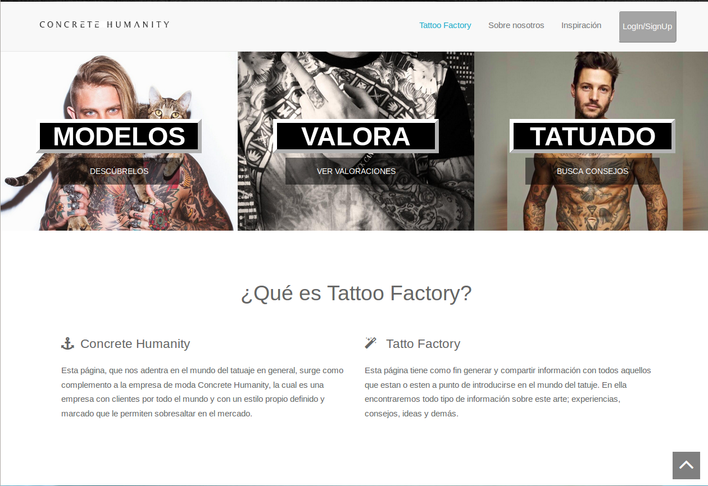

# Proyecto final de la Asignatura Desarrollo de Sistemas Informaticos 
## 3º de Itinerario Tecnologías de la Información de ESTII ULL

Hemos desarrollado una aplicación web orientada al mundo de los tatuajes donde los
usuario pueden compartir experiencias, sus tattos, ver los tatuajes de los modelos de la compañía
para poder hacerse una idea de como quedaría el futuro tatuaje. 

### Tecnologías usadas:

- REST,
- ECMA6,
- jQuery,
- Node.js, 
- ExpressJS,
- Gulp,
- Gulp-nodemon,
- Gulp-minified,
- Google Sign-In,
- LocalStorage,
- EJS,
- SASS,
- Bootstrap,
- MongoDB, 
- Mongoose.

### Nuestra Web

#### [_Campus Virtual de la Asignatura_](https://campusvirtual.ull.es/1516/course/view.php?id=144)

### Desarrolladores:

#### [_José Alberto Mena Gacía_](http://alu0100768893.github.io/)
#### [_Yeray Pérez Peraza_](http://alu0100783612.github.io/)

